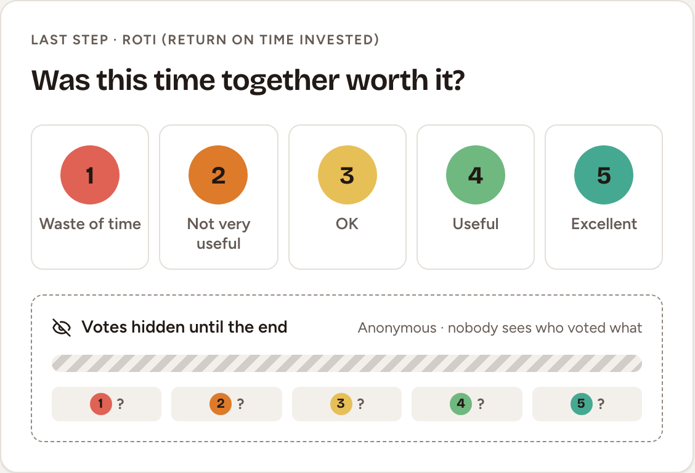
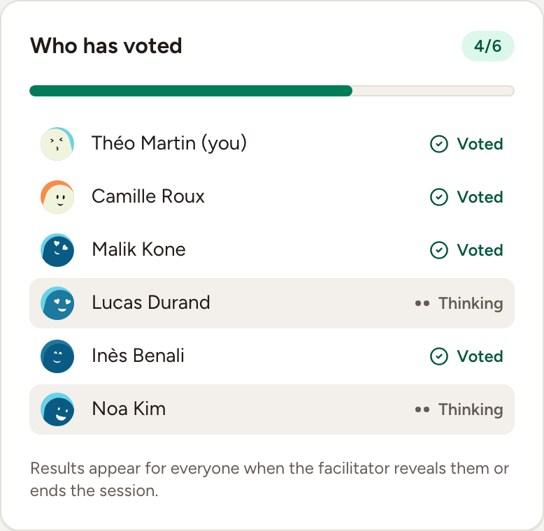
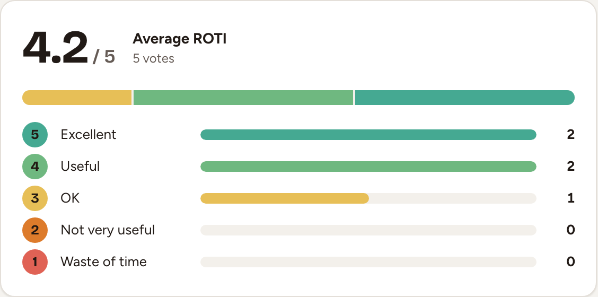
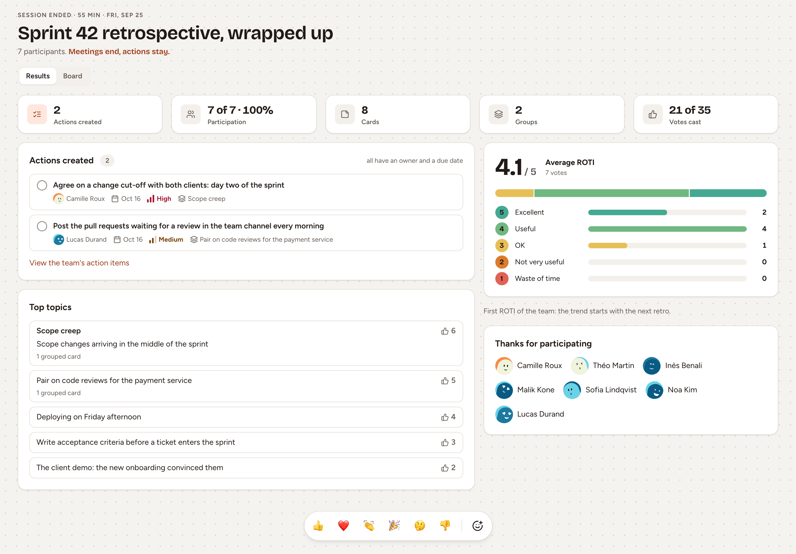

ROTI, return on time invested, is the last phase: everyone rates the retrospective from 1 to 5. This page covers the vote, its reveal, the health check that can run inside a retro, and what closing the retro leaves on screen.

## Give your ROTI

1. Read the question, **Was this time together worth it?**
2. Select a score: **1** Waste of time, **2** Not very useful, **3** OK, **4** Useful, **5** Excellent.
3. Select another score to change your mind, for as long as the facilitator has not revealed the results.

The vote is anonymous: nobody sees who voted what. Observers of the team do not vote.

## See who has voted, and nudge the others

Beside the vote, **Who has voted** lists the people present on the board with **Voted** or **Thinking** beside each name, and never a score.

The facilitator's bar has two buttons for this phase.

- **Nudge the last 2** (the number changes with the room) sends "Your ROTI vote is awaited" to the people present who have not voted. It rests for half a minute between two nudges and reads **Everyone has voted** when nobody is left.
- **Reveal ROTI** closes the vote and shows the result to everyone: the average out of 5, the number of votes and how many chose each score.

Revealing is optional. Ending the session shows the same result.

## A health check or a poll inside the retro

A retro can carry the team's health check, turned on with **Health check** when the retro is created, or added later by the facilitator with **Add survey** in the session settings.

1. Open **Health check**, in the header of the board or in its menu when the window is narrow.
2. Give each statement a score from 1 (strongly disagree) to 5 (strongly agree) and select **Submit answers**.
3. As the facilitator, select **Close the health check** when enough people have answered. Everyone then sees the results. **Reopen** takes answers again; **Remove** takes the health check off the retro.

Completing the retro closes a health check that is still open. Its results are shown with the results of the retro, with their trend across the team's retros; see also [Health and eNPS trends](../../insights/health-and-enps-trends/). The statements themselves belong to the team, see [Health check, pulse and eNPS](../../surveys/health-check-pulse-enps/).

**Add survey** also offers a **Quick poll**: one question, answered on the board, in a **Surveys** column. A retro holds up to 10 of them, and they can be added from Writing to Discussing.

## Close the retro

As the facilitator, select **End session** in the bar at the bottom, or press <kbd>Ctrl</kbd>+<kbd>→</kbd> (<kbd>⌘</kbd>+<kbd>→</kbd> on a Mac). There is no confirmation.

Everyone still on the board sees it change to the results.

- The top line gives the duration of the session and its date.
- **Results** shows the action items created, the participation, the number of cards, groups and votes, the average ROTI, the top topics, and the people who took part.
- **Board** shows the columns as they were, read-only.

Anyone who opens the retro later, from the team's **Sessions** page, sees the same thing. What the facilitator can do next, such as sending the results, is on [Summary and sharing](../summary-and-sharing/). [Phases overview](../phases/) lists what a completed retro no longer allows and how to reopen it.
