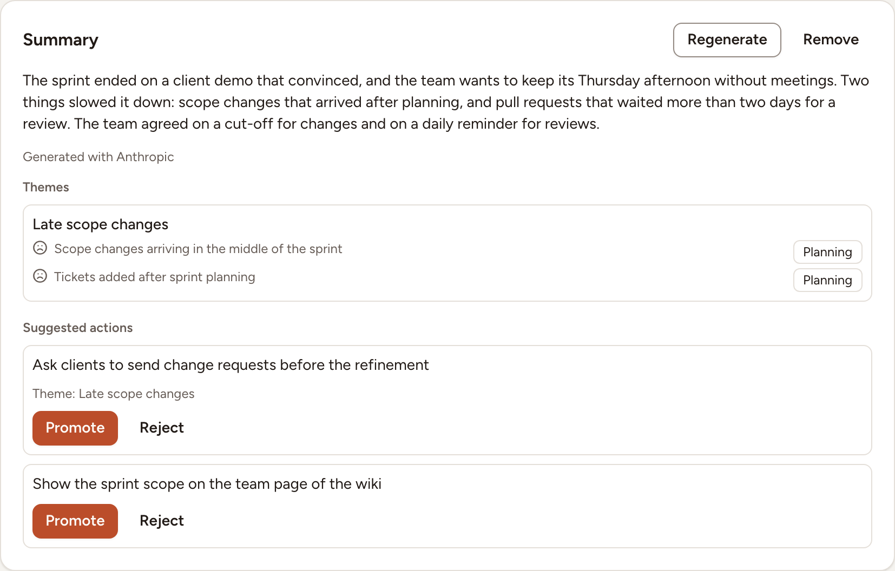
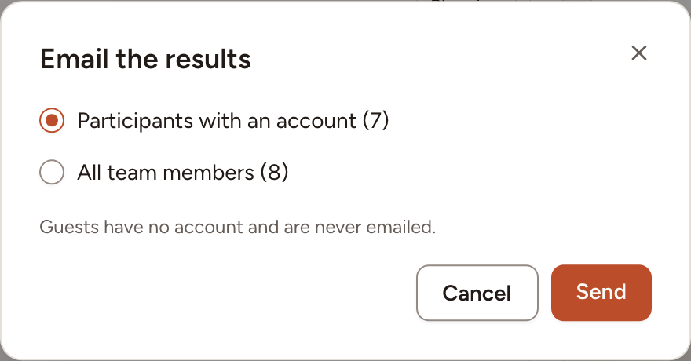

A completed retrospective keeps its results: figures, action items, ROTI, top topics. This page covers the summary a language model can add, sending the results by email or to a chat channel, and where to find a retro afterwards.

## What every completed retro shows

Open the retro. Its **Results** tab shows the action items created, the participation, the cards, groups and votes, the average ROTI, the top topics, the results of the surveys and of the health check if there were any, and the people who took part. The **Board** tab shows the columns as they were. [ROTI and close](../roti-and-close/) has a picture of it.

Without a language model on the instance, that is all: there is no **Summary** card.

## The summary, with a language model

When the instance has a language model configured, the results gain a **Summary** card.

- With **Automatic AI summary** on in the session settings, the summary is requested as soon as the retro is completed. The card reads **Generating the summary…** until it is ready.
- With it off, no summary request is sent automatically. The facilitator sees **Generate summary** on the card, with the name of the provider the board content would be sent to, and decides.

The card then holds:

- a short text, signed **Generated with** and the name of the provider;
- **Themes**: the cards the model put together, each with the mood and the category the model gave it;
- **Suggested actions**, to **Promote** into action items or **Reject**, see [Actions](../actions/).

The facilitator can **Regenerate** the summary or **Remove** it. If the request fails, the card says that the summary could not be generated and offers **Retry**.

### What the AI request includes

A summary request sends the retro title, column names, card text and group names, vote totals, topic notes, action-item text, health-check results, survey results (including free-text answers) and ROTI aggregates. Account details, card-author identities and individual voter identities are not included. Text that participants put into a card, note or answer remains part of that content. Large boards are limited to a request budget, with the most-voted topics first, so a summary may not cover every card.

The summary is generated in the retro creator’s language, falling back to the facilitator’s language and then the instance language. The response also supplies themes, card mood/category labels and suggested actions; these are stored with the retro. Card mood labels are positive, neutral or negative, with a short category supplied by the model. They appear with the generated insights and can also remain visible when the board is reopened. Review them against the original cards; they describe card content, not the people who wrote it.

### Control generation and recovery

The facilitator controls **Automatic AI summary** under **Session settings › AI** before completion. Turning it off stops the automatic request and group-name suggestions. It does not block a later manual **Generate summary** request or the facilitator’s poll-drafting button.

Only the facilitator can generate, regenerate or remove a summary on a completed retro. **Regenerate** sends a new request to the currently configured provider. **Remove** clears the generated summary and insights from Skrüm; it does not delete data already received by the provider. If generation fails, the original board remains available and the facilitator can select **Retry**.

For self-hosting, an instance admin configures the model and credentials in [AI configuration](../../administration/ai/). Automatic summaries run in the queue: a working queue worker is required.

## Send the results by email

The facilitator of the retro, if they are a member of the team, and the workspace's owners and admins can send the results. The button is there when the instance can send mail: see [Mail](../../administration/mail/).

1. On the completed retro, select **Send the recap by email**.
2. Choose the recipients: **Participants with an account** or **All team members**. Guests have no account and are never emailed.
3. Select **Send**.

Each person receives the figures of the session, the action items with their owners, the ROTI, the summary if there is one, and a button that opens the retro. The mail is written in the language of the person who receives it. A second send is refused for ten minutes after the first.

## Send the results to a channel

When the team has a chat integration connected, the same people have a **Share** menu on the completed retro, with one entry per channel, such as **Share to Slack**.

1. Select **Share**, then the channel.
2. Read what the recap includes: the title, the date and the participants; the number of cards and the average ROTI; the summary when there is one; the action items with their assignees; the suggested actions still pending; the top card of each column.
3. Select **Send**.

Card authors, votes and comments are never shared. [Integrations](../../integrations/overview/) lists the channels and how to connect them.

## Find a finished retro

- The team page lists the latest ones under **Recent sessions**.
- **Sessions**, in the sidebar, lists all the sessions of the team; filter on the retros.
- The action items the retro produced are on the team's action items page, see [Track action items](../../action-items/track/).
