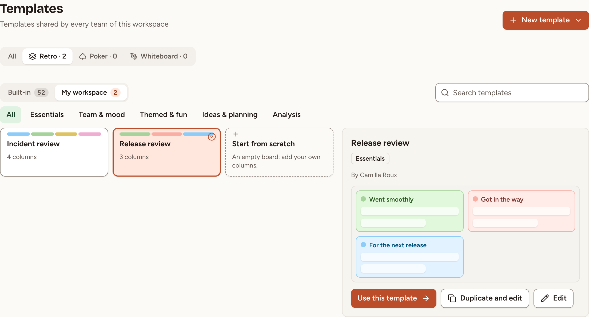
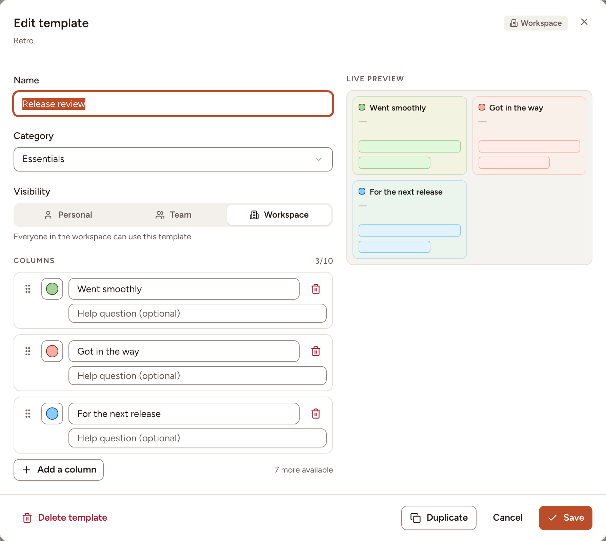

A template sets the columns of the board: their titles, their help texts and their colours. Skrüm has 52 built-in templates in 5 categories (Essentials, Team & mood, Themed & fun, Ideas & planning, Analysis), and you can write your own. This page shows where the templates are and how to create, edit and delete a custom one.

## See the templates

1. In the sidebar, under **Workspace**, select **Templates**.
2. Select the **Retro** tab.
3. Switch between **Built-in** and **My workspace**, filter by category, or type in **Search templates**.
4. Select a template to see its columns on the right.

From the preview, **Use this template** opens the New session dialog of your current team with that template, and **Duplicate and edit** opens a copy in the editor. On a template you may change, **Edit** opens the template itself.

## Create a template

1. Select **New template**, then **Retro template**.
2. Optionally choose a template under **Start from a built-in template** to begin with its columns.
3. Give it a **Name** (80 characters at most, and not the name of another template of the workspace) and a **Category**.
4. Choose its **Visibility**, see the table below.
5. Under **Columns**, give each column a title, a colour and, if you want, a help question shown under the title on the board. Drag a column to reorder it. **Add a column** adds one, up to 10.
6. Check the **Live preview**, then select **Save**.

| Visibility | Who can use the template | Who may give it this visibility |
|---|---|---|
| **Personal** | Only you | Every member of the workspace |
| **Team** | Everyone in the team you choose | Owners and facilitators of that team, workspace owners and admins |
| **Workspace** | Everyone in the workspace | Workspace owners and admins |

The same rule decides who may edit or delete a template afterwards: a personal template belongs to the person who created it, a team template to those who run the team's rituals, a workspace template to the workspace's owners and admins.

You can also save a template while creating a retro, with **Save as team template** in the New session dialog, see [Create a retro](../create-a-retro/).

## Edit, duplicate or delete a template

1. On the **Templates** page, select the template and then **Edit**.
2. Change what you need and select **Save**. **Duplicate** makes a copy instead.
3. To remove it, select **Delete template** and confirm.

> Retros already created from a template are not affected when you edit or delete it: the columns were copied into each retro when it was created.
