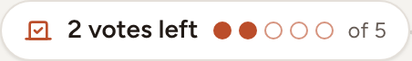
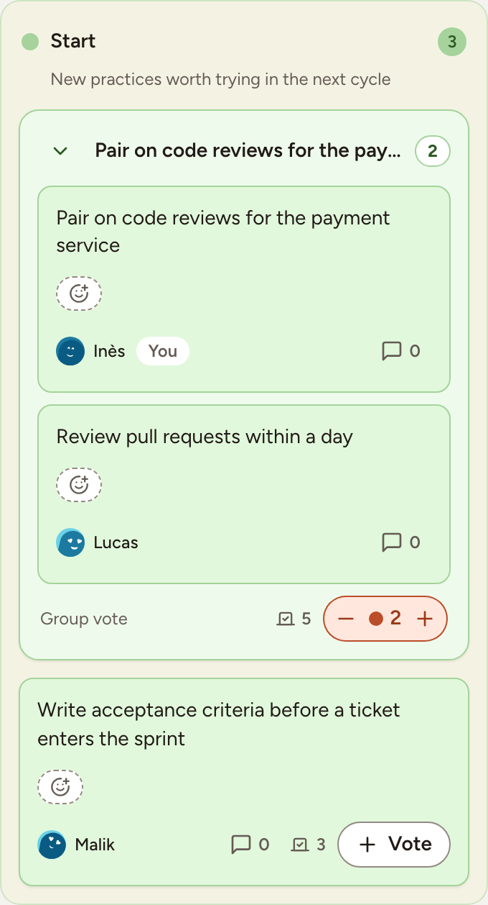
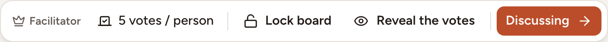

In the Voting phase everyone spreads a fixed number of votes over the cards and groups. The most voted topics are discussed first. This page covers the number of votes, casting and taking back a vote, what stays hidden, and how the facilitator knows the room has finished.

## How many votes you have

The facilitator sets the number, when creating the retro or in the session settings under **Voting**:

- **Votes per participant**: with **Automatic vote limit** on, everyone gets the number of topics on the board plus 3, at most 10 (a group counts as one topic). With it off, the facilitator chooses a number from 1 to 20.
- **Max per card**: **No limit per card**, or the most votes one person can put on the same card.

Both can be changed only before voting starts. Once the board is in Voting, the facilitator's bar shows the limit, for example **5 votes / person**.

Your own budget is shown above the columns.

## Vote

1. Select **Vote** on a card. A group is voted as a whole, on its **Group vote** line.
2. Select **+** to add another vote to the same card, as long as you have votes left and the limit per card allows it.
3. Select **−** to take a vote back and use it elsewhere.

With the keyboard, move the focus to a card and press <kbd>V</kbd> to vote, <kbd>Shift</kbd>+<kbd>V</kbd> to take a vote back.

Votes can be changed for as long as the board stays in Voting. Observers of the team do not vote, and nobody votes while the board is locked.

## What is visible

- Nobody sees who voted for what. The board only shows a total per card and your own votes.
- The totals are visible to everyone while voting, unless the facilitator hides them: **Hide the votes** in the facilitator's bar, or **Hide vote counts** in the session settings. A badge then says **Votes hidden until the reveal**, and you only see your own votes.
- The facilitator shows the totals again with **Reveal the votes**. They are always visible from the Discussing phase on.

## Say that you have finished

1. Select **I have finished voting** above the columns when you are done.
2. To change your mind, select **Change my votes**. Casting or taking back a vote after finishing also removes your mark.

Above the columns, everyone sees how far the room is: the votes cast out of all the votes available, and a count such as "5/8 have finished" of the people present on the board. The facilitator reads that count to decide when to move to [Discussion](../discussion/); the board does not move by itself.
