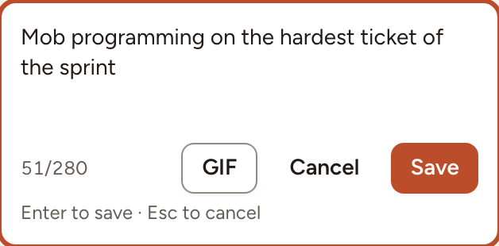
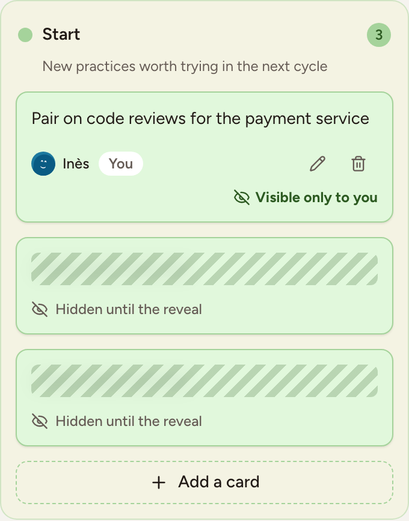

In the Writing phase everyone writes cards in the columns of the board. Nobody reads the cards of the others until the facilitator moves to Grouping. This page covers writing, editing and deleting a card, what the others see meanwhile, anonymity, and how the facilitator changes the columns.

## Write a card

1. Select **Add a card** at the bottom of a column, or press <kbd>N</kbd>.
2. Type your card, 280 characters at most.
3. Press <kbd>Enter</kbd> or select **Save**. <kbd>Shift</kbd>+<kbd>Enter</kbd> starts a new line.
4. The field stays open for your next card. Press <kbd>Esc</kbd> or select **Cancel** when you are done.

The **GIF** button attaches a GIF to the card, alone or with text. It is there only when the instance has a GIF provider configured and **Allow GIFs** is on in the session settings.

Observers of the team follow the board without writing.

## Edit or delete your card

Each of your cards carries a pencil (**Edit card**) and a bin (**Delete card**). You can change or remove your own cards during Writing and Grouping, not afterwards, and never the cards of someone else.

## What the others see

- Your cards are marked **Visible only to you**.
- The cards of the others appear as striped placeholders, **Hidden until the reveal**. You see how many there are, not what they say or who wrote them. This holds for the facilitator too.
- The line above the columns counts the cards and how many of the people present have written, for example "8 cards · 6/6 have written".
- While you type, the others see that you are writing a card, not its text.

Everything is revealed when the facilitator moves the board to [Grouping](../grouping/).

## Anonymous cards

When **Anonymous cards** is on, the author of a card is never shown to anyone else, in any phase, and the board says how many people are writing instead of naming them. The facilitator's bar shows **Anonymity: on** or **Anonymity: off** during Writing.

The facilitator turns it on when creating the retrospective or in the session settings. It can be turned off again only while the board has no card and nobody has answered a survey or the health check of the retro.

## Lock the board

The facilitator can select **Lock board** in the bar at the bottom. While the board is locked nobody can add or edit a card, and the header shows that the board is closed for editing. Select it again to unlock.

## Manage the columns

The facilitator can change the columns during the Icebreaker and Writing phases:

- **Add column**, at the right of the last column, up to 10 columns;
- the menu of a column (**Column menu**) to **Rename** it, **Edit description**, change its **Colour**, **Move left** or **Move right**, or **Delete column**.

> Only empty columns can be renamed, recoloured or deleted. A column that holds a card can still be moved and have its description changed.
