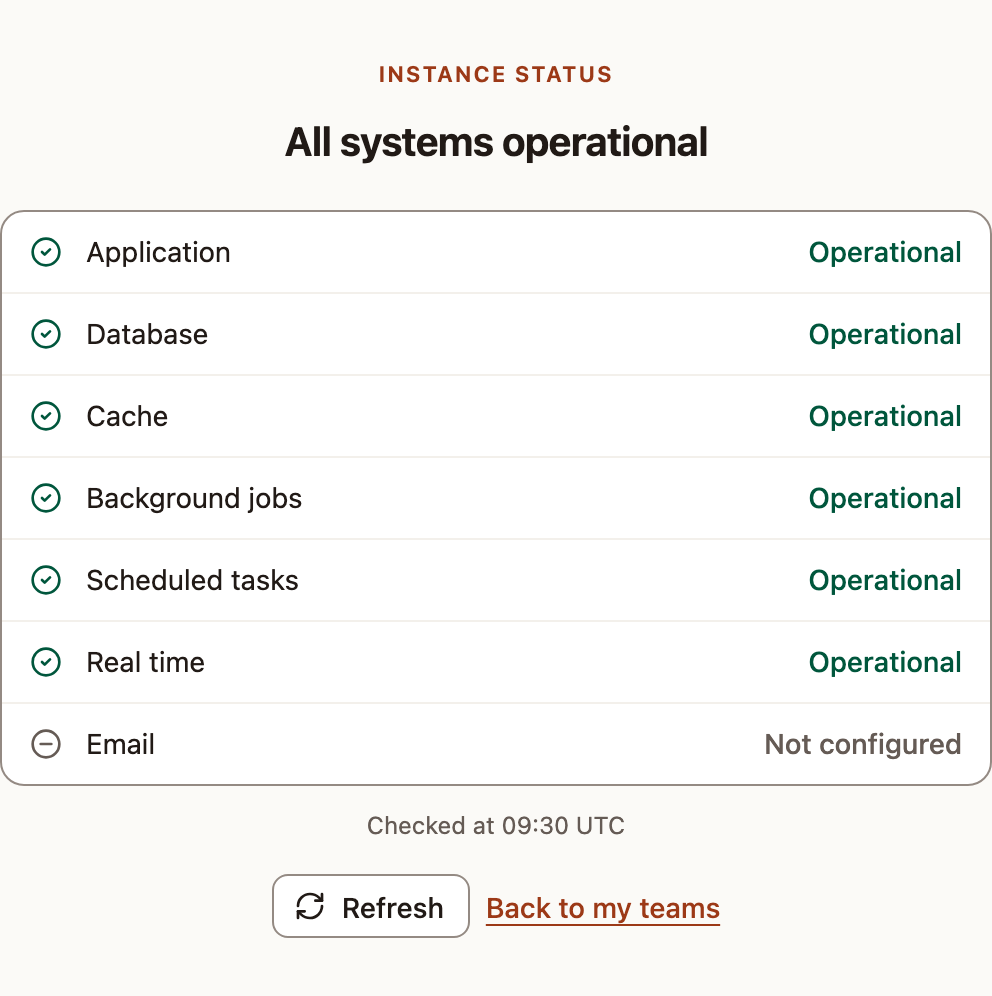

Know what runs inside the Skrüm container, and read the status page to tell whether each part answers. The status page is public: anyone who reaches the instance can open it.

## What runs in the container

One container runs four services. A supervisor restarts each of them when it stops.

| Service | What it does |
|---|---|
| Web server | FrankenPHP, which contains Caddy, runs the application and serves the pages on ports 80 and 443 |
| Realtime server | Reverb carries the live updates of sessions over websockets. It listens inside the container only; Caddy passes it the paths `/app/*` and `/apps/*` |
| Queue worker | Runs the background jobs: mails, messages to integrations, reads of the trackers, retro summaries |
| Scheduler | Starts the recurring tasks listed below |

Before these services start, the container prepares itself. It checks that the required variables are set, checks the database, then applies the pending migrations. If one step fails, the container stops and its log says why.

The Compose files give the container 20 seconds to stop, so that the services can finish what they are doing.

## What the scheduler does

| When | Task |
|---|---|
| Every minute | Records a heartbeat for the status page |
| Every minute | Reads the Telegram bot: the codes that connect a chat, and the chats that removed the bot |
| Every minute | Queues a read of each synced tracker integration that is due (see `INTEGRATIONS_POLL_MINUTES` in [Configuration reference](../configuration/)) |
| Every day, at `SKRUM_ACTION_ITEM_REMINDER_TIME` | Sends the reminders of action items that are due soon or overdue |
| Every day | Checks that every active team integration still has access |
| Every day | Asks for the latest version, when the update check is on |
| Every day | Deletes what has expired: audit events older than 365 days, integration delivery records older than 90 days and their content after 30 days, received webhook events older than 7 days, sign-in links and codes that expired more than a day ago, API tokens that expired more than 30 days ago |
| Every day | Cleans up the whiteboards: the expired records of deleted elements, and the images no longer used |

## The status page

Open `/status` on your instance, for example `https://skrum.example.com/status`. You do not need to sign in. The error pages link to it under **Instance status**.



The title sums up the lines: **All systems operational**, **Some systems are degraded** or **Maintenance in progress**.

| Line | What is checked |
|---|---|
| **Application** | **Maintenance** while the instance is in maintenance mode, **Operational** otherwise |
| **Database** | The database answers a query |
| **Cache** | A value written to the cache is read back |
| **Background jobs** | The queue worker ran its heartbeat job |
| **Scheduled tasks** | The scheduler recorded its heartbeat |
| **Real time** | The realtime server accepts a connection |
| **Email** | **Not configured** while the mailer is `log`, **Operational** otherwise. The page does not contact the mail server |

A heartbeat is recorded every minute. **Background jobs** and **Scheduled tasks** read **Operational** when the last one is less than 3 minutes old, **Degraded** up to 15 minutes, and **Unavailable** after that. Right after a start, they can read **Unavailable** until the first heartbeat, about a minute later.

The page shows the time of the check, in UTC. **Refresh** asks again; the checks themselves run at most once every 10 seconds. The page answers during maintenance too, and is written in the language of the visitor's browser when it is English, French, Spanish or German.

## The health check of the container

Docker asks the container for the address `/up` every 30 seconds. `docker compose -f compose.production.yaml ps` shows the result: `healthy` once the web server answers.

## Logs

The container writes its log to the standard error output, from the `warning` level up:

```bash
docker compose -f compose.production.yaml logs app
```
