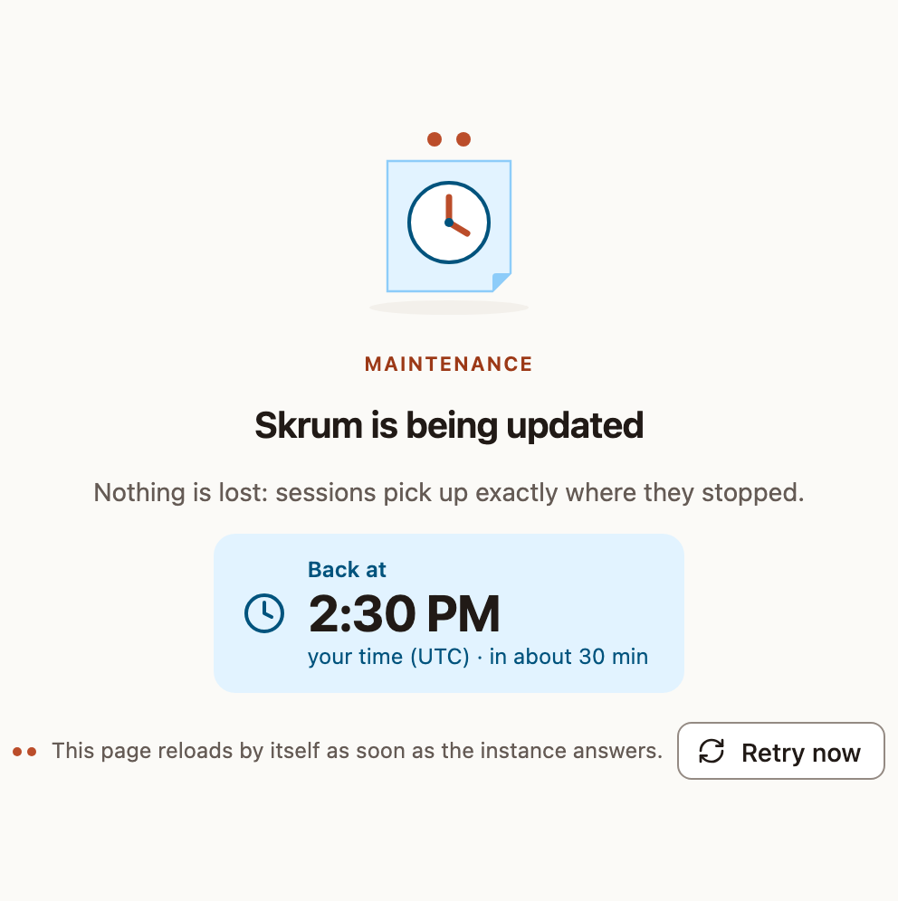

Move your instance to a newer version: back up, pull the new image and recreate the container. Skrüm applies its database migrations by itself when the container starts. The commands use `compose.production.yaml`; with the MariaDB or the SQLite file, use that file in each command.

## Choose when upgrades happen

By default the Compose files and Coolify template use `ghcr.io/arnaud-ritti/skrum:latest`. This is a moving tag, so pulling and redeploying can bring a newer image. Stable release images are built from their release tag. Before building, the Docker workflow automatically synchronizes Composer, its lock file and the application version fallback with that tag in the image sources, preserving `latest` references. After image publication, the workflow automatically opens a repository version-sync PR, runs CI and documentation checks against its exact commit, then merges it if validation passes. A failed check leaves the PR open. The **Sync release version** workflow can be run manually to retry the latest stable release; no preparation PR is needed before publishing.

To upgrade when you choose, set the image in `.env` to a release:

```ini
SKRUM_IMAGE=ghcr.io/arnaud-ritti/skrum:<version>
```

A release is published under its version number, such as `1.2.3`, and under its minor line, such as `1.2`. To upgrade, change the version in `.env`, then follow the steps below.

## Back up

Back up two things, together:

- The database. With the default file, it is the PostgreSQL database of the `pgsql` service, kept in the `pgsql-data` volume. For example, with the default user and database name:

  ```bash
  docker compose -f compose.production.yaml exec -T pgsql pg_dump -U skrum skrum > skrum.sql
  ```

- The uploaded files, kept in the `app-storage` volume. For example:

  ```bash
  docker compose -f compose.production.yaml cp app:/app/storage/app ./storage-app-backup
  ```

For SQLite, see [Database](../database/).

## Show a maintenance page

This step is optional. It tells people who are using the instance that it will come back.

1. To add a message of your own, open **Administration**, then **General**, and fill **Message** in the **Maintenance message** card, 280 characters at most. Select **Save**. Only an instance admin can do this. The page shows the message that is saved at the moment maintenance starts, with the name of the admin who wrote it.
2. Start maintenance, with the number of seconds you expect it to last:

   ```bash
   docker compose -f compose.production.yaml exec -u www-data app php artisan down --retry=1800
   ```



Everyone now sees this page in place of the application. It shows the time of return, computed from `--retry` and written in each visitor's own time zone. It asks the instance every 30 seconds whether it answers, and reloads by itself when it does. The [status page](../processes/) stays available and reads **Maintenance in progress**.

Recreating the container ends maintenance: the new container starts in normal mode. If you did not recreate it, end maintenance yourself:

```bash
docker compose -f compose.production.yaml exec -u www-data app php artisan up
```

## Pull and recreate

```bash
docker compose -f compose.production.yaml pull && docker compose -f compose.production.yaml up -d
```

When the new container starts, it checks the database and applies the pending migrations before it serves the first page. If it keeps restarting, `docker compose -f compose.production.yaml logs app` says why.

## Know when a new version exists

Skrüm does not look for new versions unless you ask it to. To turn the check on, as an instance admin:

1. Open **Administration**, then **General**.
2. In the **Updates** card, turn on **Check for new versions once a day**, then select **Save**.

The instance then asks GitHub for the latest release once a day, and sends nothing about itself. **Check now** asks at once. The card shows the running version and the result of the last check. The Administration menu shows the version too and, after a check, whether it is up to date.

An image built from the `main` branch, tagged `main`, is not a release: the card says that it is not compared with new versions.

## Notes for instances installed from an early build

These notes concern you only if your Compose file or your `.env` is older than the change they describe.

### Uploaded files moved to a volume

Before the `app-storage` volume existed, profile photos and brand assets were kept in the container itself. The first time you upgrade to a Compose file that has the volume, copy them out before the upgrade and back in after it, and give them to the user of the application:

```bash
docker compose -f compose.production.yaml cp app:/app/storage/app ./storage-app-backup
docker compose -f compose.production.yaml pull && docker compose -f compose.production.yaml up -d
docker compose -f compose.production.yaml cp ./storage-app-backup/. app:/app/storage/app
docker compose -f compose.production.yaml exec -u root app chown -R 82:82 /app/storage/app
```

### Realtime credentials are optional

`REVERB_APP_ID`, `REVERB_APP_KEY` and `REVERB_APP_SECRET` are derived from `APP_KEY` when they are empty. Values you already set are kept: an existing `.env` needs no change.

### Password breach check

New passwords are checked against known data breaches, which needs outbound access to `api.pwnedpasswords.com`. On an instance without it, set `SKRUM_PASSWORD_BREACH_CHECK=false`. See [Configuration reference](../configuration/).

### Profile photos

Profile photos are off until an instance admin turns on **Profile photos** in **Administration**, then **Branding**. They are kept in the `app-storage` volume.

### Active sessions behind a proxy

The **Active sessions** card of the account's security settings shows the IP address of each device. Behind a reverse proxy, set `TRUSTED_PROXIES`, or every line shows the address of the proxy.
