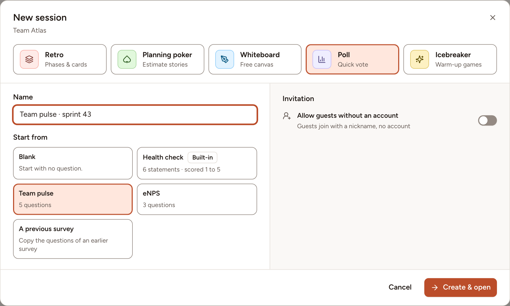
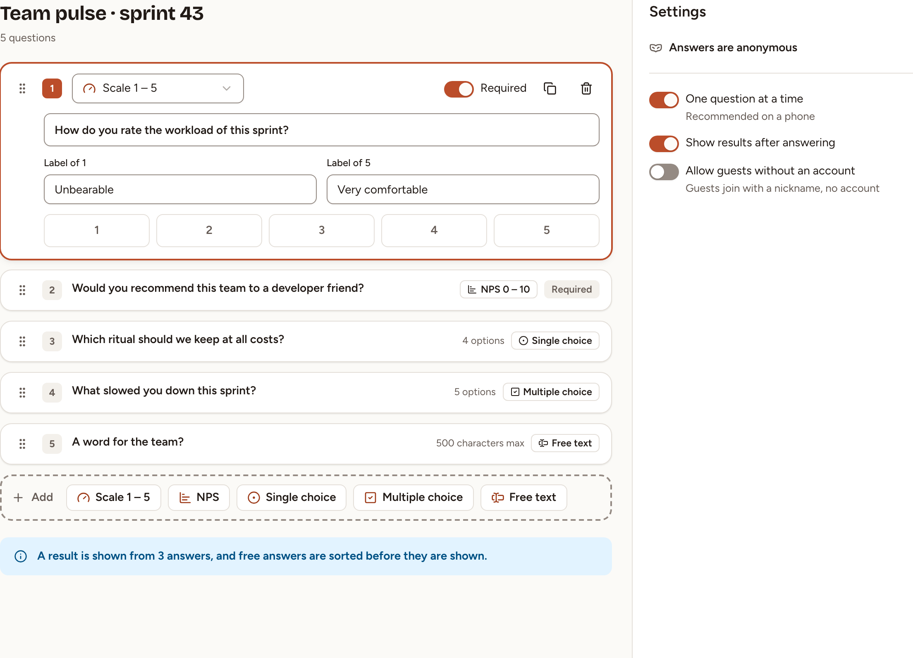
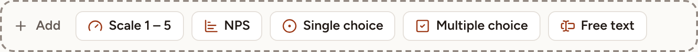
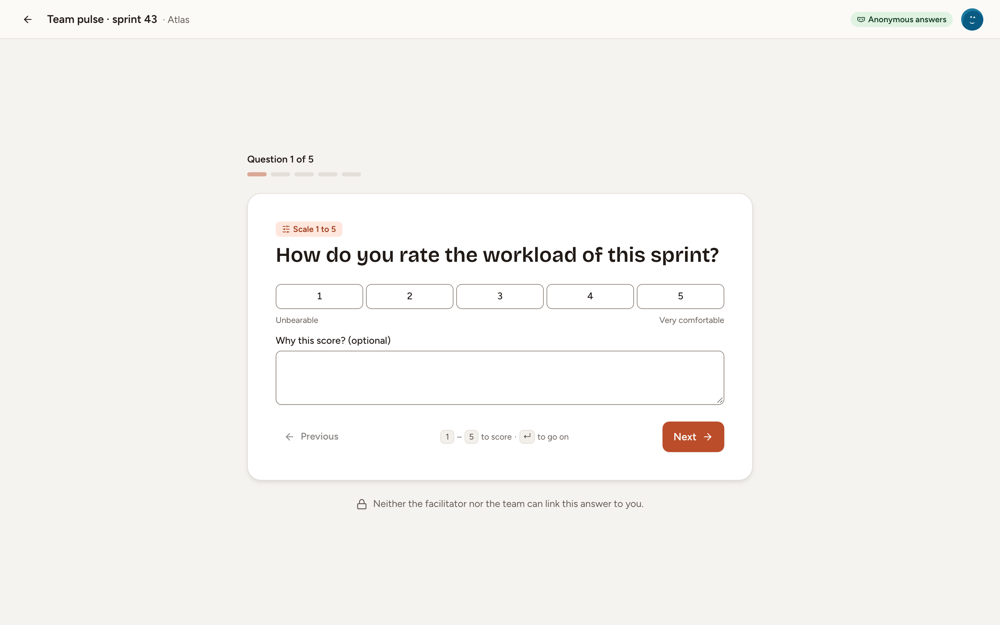

A survey asks the team a list of questions and shows the answers without names. Every member of a team can create one, except observers; so can the workspace's owners and admins.

Whoever creates a survey is its facilitator. Only the facilitator and the workspace's owners and admins can edit, publish, close, reopen or delete it.

## Create the survey

1. On the team's page or its **Sessions** page, select **New session**.
2. Choose the type **Poll**: this is what the dialog calls a survey.
3. Type a **Name**, 120 characters at most.
4. Under **Start from**, choose **Blank**, one of the three [ready-made surveys](../health-check-pulse-enps/), or **A previous survey** to copy the questions and settings of a survey the team has already published.
5. Turn on **Allow guests without an account** if people outside the team will answer.
6. Select **Create & open**.

The survey opens in its builder as a **Draft**, listed only to its facilitator and to the workspace's owners and admins.

## Write the questions

1. In the **Add** bar, select a kind. The question is added at the end as **Untitled question**.
2. Type the question, 200 characters at most, and fill what its kind asks for.
3. Turn on **Required** if nobody may skip it.

| Kind | What people answer | What you fill |
|---|---|---|
| **Scale 1 – 5** | A score from 1 to 5 | **Label of 1** and **Label of 5**, optional texts under the ends of the scale |
| **NPS** | A score from 0, **Not at all likely**, to 10, **Extremely likely** | Nothing |
| **Single choice** | One option | 2 to 10 options |
| **Multiple choice** | One option or more | 2 to 10 options |
| **Free text** | A text of 500 characters at most | Nothing |

Select a question to open it. The list at its top changes its kind, the two buttons beside **Required** duplicate or delete it, and the handle at its left moves it. A survey has at most 30 questions.

Each change is saved as you make it; there is no save button. **Preview** shows the survey as a participant sees it and saves no answer.

## Choose the settings

| Setting | When it is on |
|---|---|
| **One question at a time** | One question per screen, with **Previous** and **Next**; off, every question is on one page. On by default |
| **Show results after answering** | A person who has finished sees the results while the survey is still open; off, results wait until it is closed. On by default |
| **Allow guests without an account** | Anyone with the guest link answers under a nickname |

## Publish it

Select **Publish**; the survey needs at least one question. It becomes **Open** and its questions can no longer change. **Back to draft** stays available until someone answers.

Members find an open survey on the **Sessions** page, under **Live now**. **Join** opens its results page, where someone who has not answered follows **Answer the survey to see the results.** to the questions.

> With **Show results after answering** off, the results page has no link to the questions. Send people their address, which is the address of the results page without `/results`.

## Who answers, and what stays anonymous

The team's members answer, and so can the workspace's owners and admins. An observer reads the questions and cannot answer. Each answer is saved when it is given; **Finish** ends the survey, and **Change my answers** reopens it while the survey is open.

Answers are always anonymous; this is not a setting:

- The results and the CSV export show no name, only how many people answered.
- No result is shown before three people have answered.
- Free-text answers are listed in alphabetical order, not in the order they were written.

Skrüm does keep in its database which answers belong to which person, so that people can change their own. No screen and no export shows it.

## Let guests answer

On the results page of a published survey, open **Share with the team**. With guest access on, the dialog shows the guest link, its QR code and a **Session code**. The people who can edit the survey also turn guest access on or off there, and replace the link with **Regenerate link**.

A guest types a nickname, answers like a member and does not see the team's name; see [Join as a guest](../../getting-started/join-as-guest/). Turning guest access off or replacing the link ends the access of the guests who had joined.

## Close, reopen, duplicate, delete

- **Close**: on the results page, select **Close the survey** and confirm. Nobody can answer any more, and everyone who can open the survey sees its [results](../results/).
- **Reopen**: on the results page of a closed survey, open **More actions** and select **Reopen**.
- **Duplicate**: on the **Sessions** page, open **More actions** on the survey's row and select **Duplicate**. Anyone who may create a survey can. The copy is a draft with the same questions and settings.
- **Delete**: in the same menu, select **Delete**. The questions and the answers are deleted too.
