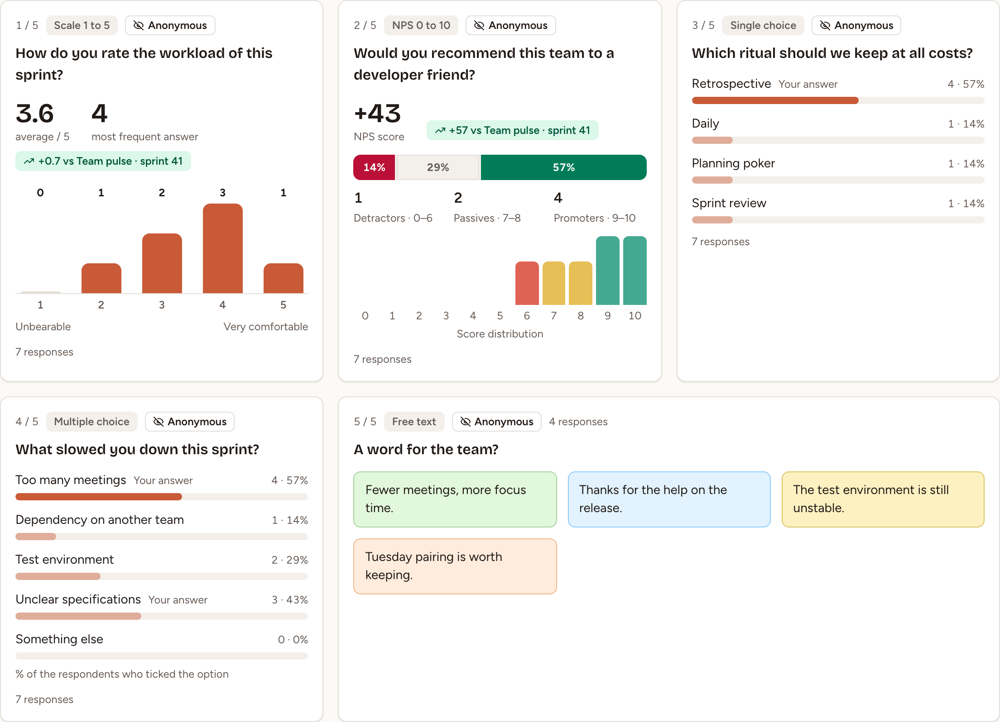
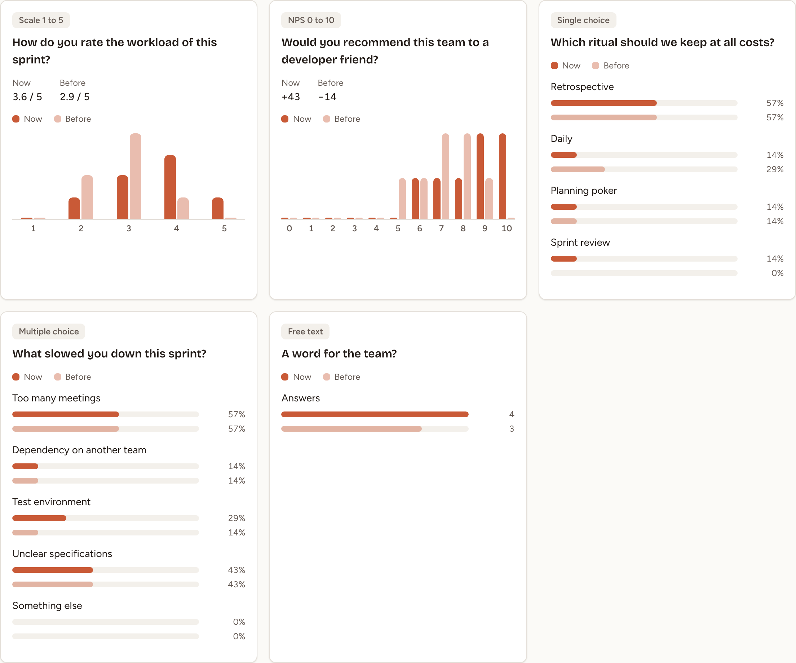

The results page of a survey shows one card per question, the free-text answers, and the differences with another survey of the team. The answers of a closed survey can be exported as a CSV file.

## Open the results

On the team's **Sessions** page, select a survey that is open or closed. From the builder, select **View results**; on the page of the questions, the people who can edit the survey have a **Results** button.

Under the title **Results**, a line gives the number of answers out of the number of participants. The participants are the team's members without its observers, plus the guests who joined and anyone else who answered.

## Who sees the results, and when

| The survey is | Who sees its results |
|---|---|
| **Draft** | Nobody |
| **Open** | Its facilitator and the workspace's owners and admins. A person who has finished answering, when **Show results after answering** is on |
| **Closed** | Everyone who can open the survey, guests included |

Whatever the status, nothing is shown to anyone before three people have answered: the page says **Results appear from 3 answers** and counts the answers that are missing. While the survey is open, the figures move as answers arrive.

## Read the summary

The **Summary** tab has one card per question.

| Kind | What the card shows |
|---|---|
| **Scale 1 – 5** | The average out of 5, the most frequent answer, and the number of answers for each value |
| **NPS** | The NPS score, the shares and the numbers of detractors (0–6), passives (7–8) and promoters (9–10), and the number of answers for each value |
| **Single choice**, **Multiple choice** | For each option, the number of people who chose it and their share of the people who answered the question |
| **Free text** | The first six answers; **See the n answers** opens the rest |

**Your answer** marks what you answered yourself. How the NPS score is computed is explained in [Health check, pulse and eNPS](../health-check-pulse-enps/).

The **Free-text answers** tab lists every text answer and every comment, question by question, in alphabetical order. The tab is there when the survey has a free-text question or a question that takes comments.

## Compare with another survey

1. Open the **Compare** tab. Guests do not have it.
2. In **Compare with**, choose one of the team's closed surveys. The list holds the 20 closed most recently.
3. Select **View as table** to read the figures instead of the charts.

The survey chosen at first is the one this survey was duplicated from, when it is closed. For a health check it is the team's previous closed health check. With no such survey, the first of the list is chosen.

Two questions are compared when they are the same question, kept through **Duplicate**, **A previous survey** or the same ready-made survey; failing that, when they have the same text and the same kind. The others are listed under **Only in this survey** and **Only in** followed by the other survey's title.

| Kind | **Now** and **Before** show |
|---|---|
| **Scale 1 – 5** | The two averages out of 5, and the share of the answers on each value |
| **NPS** | The two scores, and the share of the answers on each value |
| **Single choice**, **Multiple choice** | The share of each option; options are matched by their text |
| **Free text** | The number of answers |

On the **Summary** tab, the cards of the scale and NPS questions carry the difference with the survey this one was duplicated from, or with the previous health check, such as **+0.7 vs Team pulse · sprint 41**, or **no change**.

When the other survey has too few answers to show its own results, the tab says **The other survey does not have enough answers.** When the team has no other closed survey, it says **Nothing to compare with yet.**

## Export the answers as CSV

The facilitator of the survey and the workspace's owners and admins can export a survey once it is closed and has at least three answers.

1. Open the results of the closed survey.
2. Select **Export CSV** at the top of the page.

The file is named `survey-<title>-<date>.csv`, with the title in lower case and hyphens and the date of the export. It is encoded in UTF-8 and separated by commas: a header line, then one line per person who answered.

| Column | Content |
|---|---|
| `Respondent` | `Respondent 1`, `Respondent 2`, and so on. The lines are sorted by their content, so the number says neither who answered nor when |
| `Q1 · ` followed by the question, one column per question | The score of a scale or NPS question, the text of a free-text answer, or the options chosen, separated by ` \| ` |
| `Q1 · comment`, after a question that takes comments | The comment |

A question left unanswered gives an empty cell. A cell that starts with `=`, `+`, `-` or `@` is prefixed with an apostrophe, so that a spreadsheet does not run it as a formula.

The team's data page also lists the CSV file of each closed survey; see [Activity and data](../../insights/activity-and-data/).
