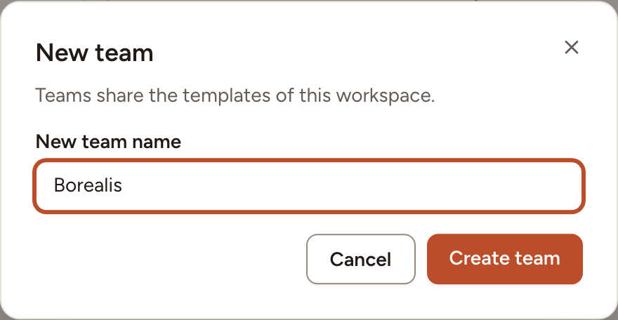
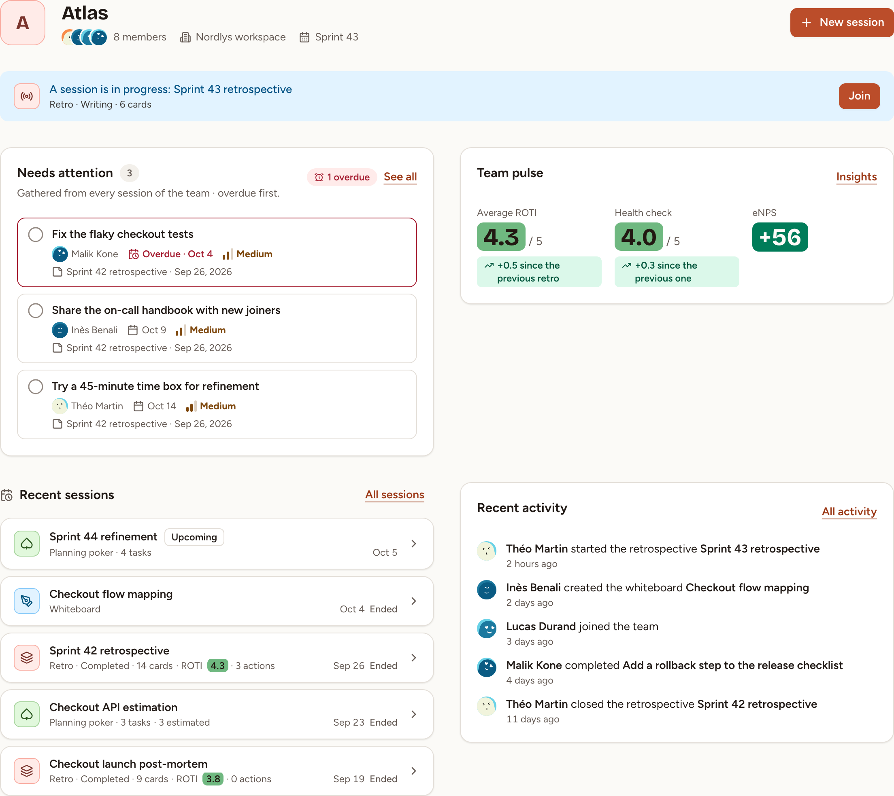

Create a team in your workspace, then find your way around its page. Workspace owners and admins create teams; everyone in a team can read its page.

## Create the team

1. In the sidebar, under **Workspace**, select **All teams**.
2. Select **New team**.
3. Type the **New team name**, 100 characters at most, and select **Create team**.

Skrüm opens the page of the new team. Creating a team does not make you one of its members: as a workspace owner or admin you can open and manage every team anyway. To fill the team, see [Members and roles](../members-and-roles/) and [Invitations and invite links](../invitations/).

While the team has no session, its page offers four tiles to start one: **New retrospective**, **New poker game**, **New whiteboard** and **New survey**.

## The team page

From top to bottom:

- The header names the team, its members and its workspace. Select the members to open the list. When the team has sprints, the header also shows the current one and the next retro. **New session** starts a retrospective, a poker game, a whiteboard, a survey or an icebreaker; an observer cannot start one.
- **A session is in progress** appears while a session is live. **Join** takes you into it.
- **Needs attention** lists the team's first five open action items, the overdue ones first. **See all** opens the full list, described in [Track action items](../../action-items/track/).
- **Recent sessions** lists the five sessions last worked on that are not in progress. **All sessions** opens the complete list.
- **Team pulse** shows the **Average ROTI** of the retrospectives, the score of the last **Health check** and the last **eNPS**, each with its change since the one before. **Insights** opens the trends, described in [Insights](../../insights/insights/).
- **Recent activity** tells who started or closed a session, completed an action or joined the team. **All activity** opens the full history.

## Move around a team

The sidebar keeps the same entries on every page of the team: **Home** (the team page), **Sessions**, **Actions** and **Insights**, then, under **Team**, **Members**, **Activity** and **Settings**. **Settings** shows only for the people who may open one of its sections.

**Sessions** lists every session of the team, the newest first, under one heading per sprint, or per month when the team has no sprints. Filter it by kind, or search a word of a title.

## The team's short address

Every team has a short address made of `/t/` and a slug taken from its name, such as `https://skrum.example.com/t/atlas`. It opens the team page for anyone who is signed in and may open the team.

The slug is the name in lower-case letters, digits and hyphens. When another team of the workspace already uses it, Skrüm adds a number (`atlas-2`). When teams of several of your workspaces share a slug, the address opens the one of the workspace you are in. A team owner changes the slug in [Team settings](../team-settings/).
