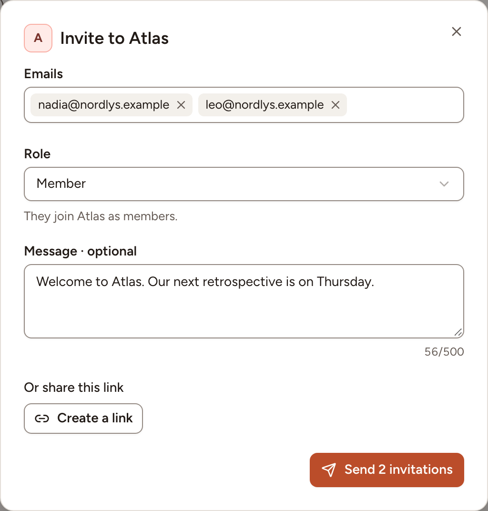
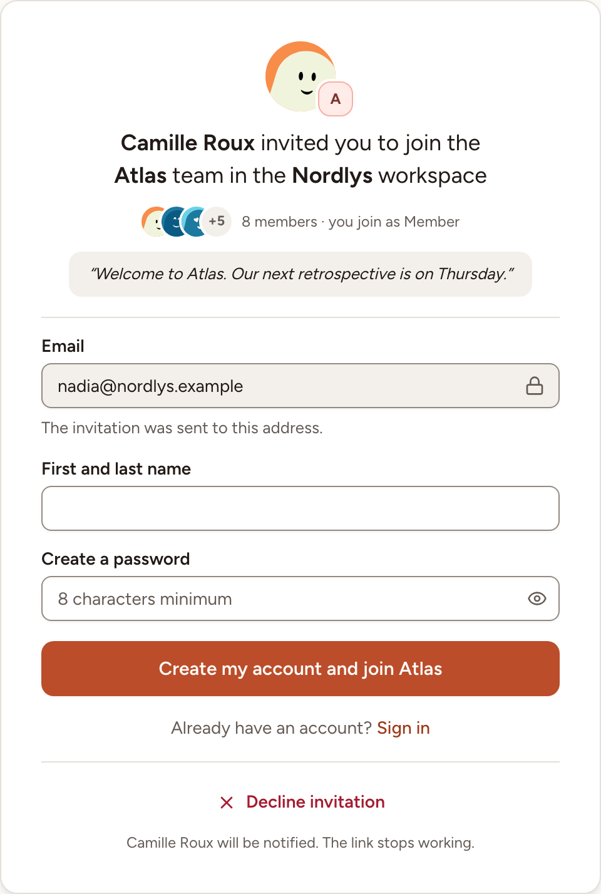
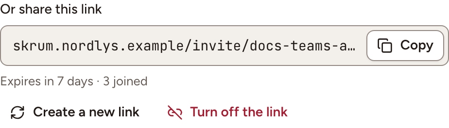

Bring people into a team by email or with a link, and follow the invitations that wait. A team's owners and facilitators invite to their team; a workspace's owners and admins invite to the workspace and to any of its teams.

## Invite people to a team by email

1. In the sidebar, under **Team**, select **Members**, then **Invite**.
2. Under **Emails**, type or paste the addresses, separated by a space, a comma or a semicolon. One invitation takes 20 addresses at most.
3. Pick the **Role** they get in the team: **Facilitator**, **Member** or **Observer**.
4. Under **Message · optional**, add a few words if you wish, 500 characters at most.
5. Select **Send 2 invitations** (the button counts the addresses).

Each person receives an email with a link that works for 7 days. By accepting, they join the workspace as a member and the team with the role you picked. Nothing is sent when one of the addresses is already in the team: the dialog tells which.

> When the instance sends no email, Skrüm shows the links once the invitations are created, so that you can pass them on yourself. See [Mail](../../administration/mail/).

## Invite someone to the workspace

Workspace owners and admins only.

1. Open the workspace's **Members** page (see [Workspaces](../workspaces/)) and select **Invite**.
2. Fill in the **Email address** and the **Role** in the workspace, **Member** or **Admin**.
3. To place the person in a team at once, pick it under **Team · optional**, then their **Role in the team**.
4. Select **Send invitation**.

## What the invited person sees

The link opens a page that says who invites them, to which team and workspace, with which role, and your message.

- Without an account, they type their **First and last name**, choose a password and select **Create my account and join Atlas**. The address is the one the invitation was sent to and cannot be changed. On an instance that signs people in with a company account only, the page shows those buttons instead.
- With an account at that address, they sign in and select **Join Atlas**. The invitation is also in their bell, with **Accept** and **Decline**.
- Signed in with another address, they are asked to log out and sign in with the invited one.

**Decline invitation** ends the link and tells the person who sent it.

## Follow the invitations

The invitations that are not accepted yet are listed after the members, on the **Members** page of the team and of the workspace, as **Invitation pending**, **Declined** or **Expired**.

- **Resend** sends a new link, good for another 7 days. The previous link stops working.
- **Revoke** deletes the invitation; its link stops working. You can invite the person again later.

## Share an invite link

A team has one invite link at a time. Anyone who has it can join the team as a **Member**; there is no limit to how many people use it.

1. On the team's **Members** page, select **Invitation link**.
2. Select **Create a link**, then **Copy**.

The link works for 7 days. Under it you read how long it has left and how many people joined through it.

- **Create a new link** replaces it: the current link stops working.
- **Turn off the link** ends it without a replacement.

The person who opens the link signs in or creates an account, confirms their email address if it is not confirmed yet, then selects **Join Atlas**. They also become a member of the workspace when they were not. On an instance where sign-up is by invitation, a working invite link is what lets a newcomer create an account; where sign-up is limited to some email domains, the link does not lift that limit. See [Sign up and sign in](../../accounts/sign-in/).
