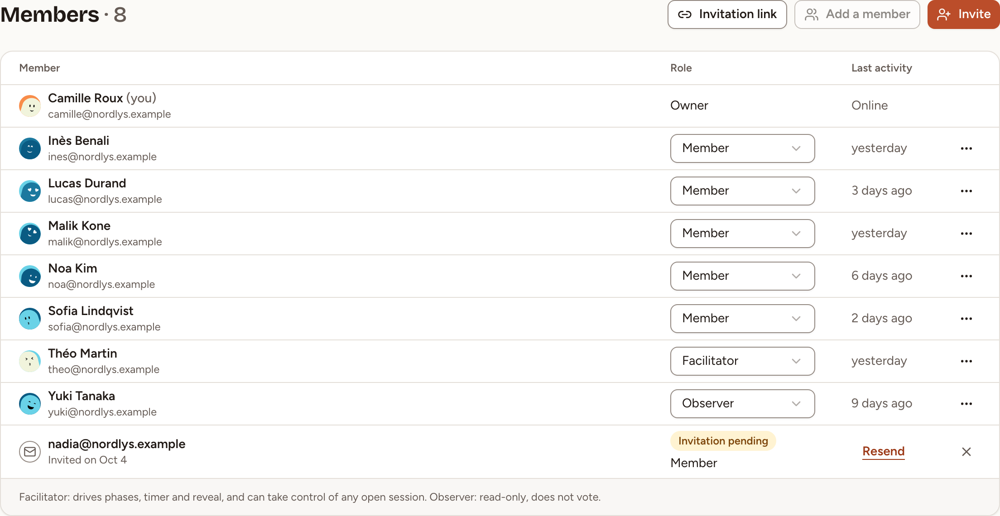
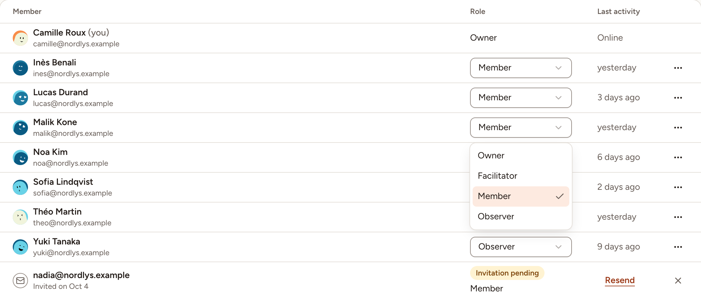
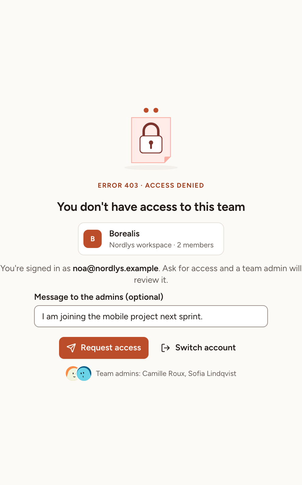
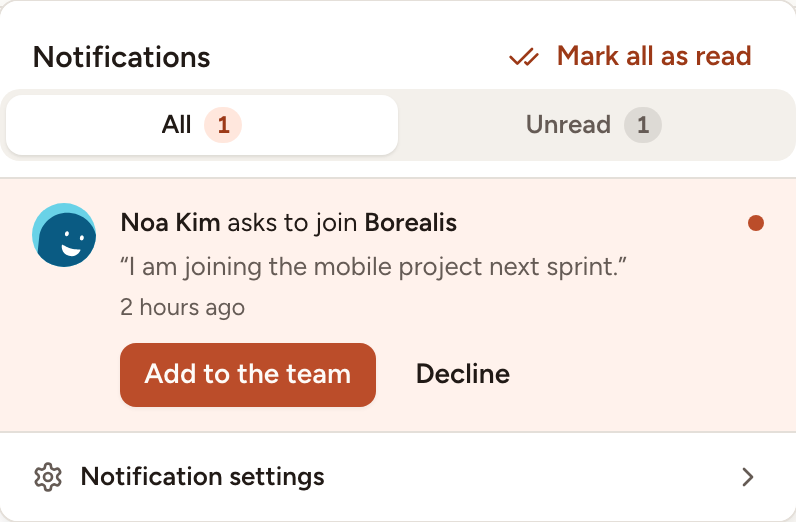

See who is in a team, give each person the role that fits, add or remove members, and answer the people who ask to join. Every member can read the list; a team owner changes it.

## The four team roles

| | Owner | Facilitator | Member | Observer |
|---|---|---|---|---|
| Open the team, its sessions and its members | Yes | Yes | Yes | Yes |
| Start a retrospective, a poker game, a whiteboard, a survey or an icebreaker | Yes | Yes | Yes | No |
| Invite people by e-mail or with the invite link | Yes | Yes | No | No |
| Take control of an open session | Yes | Yes | No | No |
| Set the sprints, the retrospective settings and the health check | Yes | Yes | No | No |
| Change roles, add and remove members, answer access requests | Yes | No | No | No |
| Rename the team, change its link, set its integrations, export its data | Yes | No | No | No |

The interface sums the two special roles up this way: "Facilitator: drives phases, timer and reveal, and can take control of any open session. Observer: read-only, does not vote."

A workspace owner or admin has the rights of a team owner in every team of the workspace, whether or not they are one of its members, and is never treated as an observer. Deleting a team is theirs alone: see [Team settings](../team-settings/).

## See the members

In the sidebar, under **Team**, select **Members**.

**Last activity** tells when each person last took part in a session of the team: **Online**, a time such as "3 days ago", or **Never**. The invitations that wait for an answer follow the members, for the people who may invite.

## Change a role

Team owners only.

1. Open **Members**.
2. In the **Role** column, open the list of the person and pick **Owner**, **Facilitator**, **Member** or **Observer**.

The change applies at once. You cannot change your own role. Someone who is no longer owner or facilitator also leaves the team's list of default facilitators, described in [Rituals and retro settings](../../retrospectives/rituals/).

## Add someone who is already in the workspace

1. Open **Members** and select **Add a member**.
2. Pick the person under **Member** and their **Role**, then select **Add**.

The button is greyed out when everyone in the workspace is already in the team. To bring in someone who is not in the workspace yet, see [Invitations and invite links](../invitations/).

## Remove a member

1. Open **Members**.
2. Open the menu at the end of the person's row and select **Remove from team**, then confirm.

They stay in the workspace and can be added back to the team.

## Access requests

Someone who belongs to the workspace and opens a team they are not in, or one of its sessions, is refused, with a way to ask for access: an optional message of 500 characters at most and **Request access**. One request at a time waits per person and team.

The request reaches the bell of the team's owners and of the workspace's owners and admins. **Add to the team** makes the person a member of the team; **Decline** refuses. Either way they are told in their own notifications.

Someone outside the workspace gets the refusal without the request: invite them instead.
