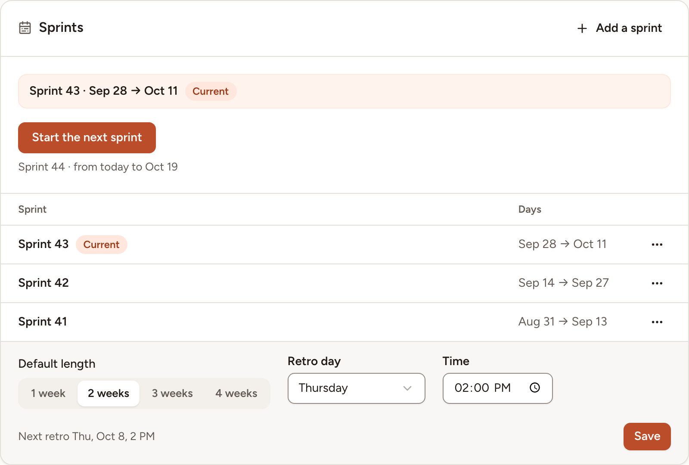

Give a team its sprints: a number and two dates each. Skrüm uses them to label the team's sessions and to tell when the next retro is due. Team owners and facilitators set the sprints, as do the workspace's owners and admins.

## What sprints are used for

Skrüm does not plan the work of a sprint. A sprint is a numbered span of days, and Skrüm reads from it which sprint a session belongs to.

- The team page shows the current sprint under the team's name, with the next retro when a retro day is set.
- **Sessions** groups the sessions under one heading per sprint, such as "Sprint 43 · Sep 28 → Oct 11", by the day each was last worked on, and puts the others under **Outside a sprint**. A team without sprints gets one heading per month.
- A new retrospective is offered the name "Sprint 43 retro", and its board shows, beside the team's name, the sprint of the day it was created.
- On the workspace page, the team's tile names the sprint of the retro in progress.
- The ROTI trend labels its retrospectives by sprint ("S43") when each of them falls in one, and by date otherwise. See [Insights](../../insights/insights/).

## Start a sprint

1. In the sidebar, select **Settings**, then **Sprints**. A team that has no sprint yet also shows **Start the first sprint** under its name on the team page.
2. Select **Start the next sprint**. The line under the button says what it will create, such as "Sprint 44 · from today to Oct 19".

The new sprint starts today, lasts the **Default length**, and takes the number after the highest one. A sprint that was in progress now ends yesterday. The button is greyed out, with the reason under it, when a sprint already starts today or is planned for a later day.

## Add, edit or delete a sprint

To enter a sprint with your own number and dates, for the past or the future:

1. Select **Add a sprint**.
2. Fill in the **Number**, the **First day** and the **Last day**, then select **Add**.

The rules: a number from 1 to 9999, used once in the team; no day shared by two sprints; eight weeks at most.

To correct or remove a sprint, open the menu at the end of its row and select **Edit** or **Delete**. The sessions of a deleted sprint keep their content and lose its label.

The list shows the ten latest sprints; a button under it shows the others.

## Set the length and the retro day

Under the list:

- **Default length**: 1 to 4 weeks, 2 unless you change it. It is the length **Start the next sprint** gives, and the one **Add a sprint** proposes.
- **Retro day**: a day of the week, or **None**.
- **Time**: optional, once a retro day is chosen.

Select **Save**. With a retro day, Skrüm shows the next retro: the last such day of the current sprint or, once it has passed, of the sprint that follows. It reads "Next retro Thu, Oct 8, 2 PM" here and on the team page. When no sprint is left to hold one, it reads "No next retro until the next sprint is started."

Days are counted in the time zone of the instance.
