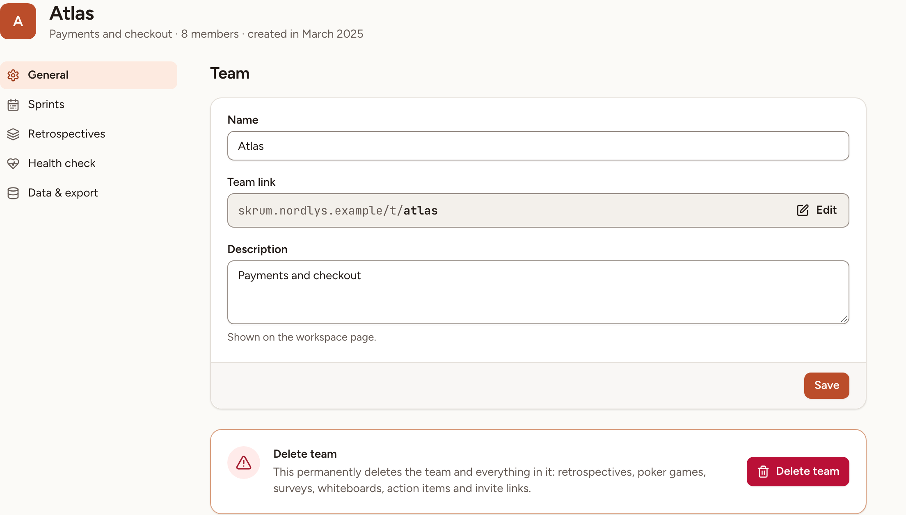

Rename a team, describe it, change its short address or delete it, and find the other sections of its settings. The **General** section is for team owners and for the workspace's owners and admins.

## Open the settings

In the sidebar, under **Team**, select **Settings**. The entry appears only when you may open at least one section.

| Section | What it holds | Who opens it |
|---|---|---|
| **General** | The name, the link, the description, and deleting the team | Team owner |
| **Sprints** | See [Sprints](../sprints/) | Team owner, facilitator |
| **Retrospectives** | See [Rituals and retro settings](../../retrospectives/rituals/) | Team owner, facilitator |
| **Health check** | See [Health check, pulse and eNPS](../../surveys/health-check-pulse-enps/) | Team owner, facilitator |
| **Integrations** | See the [Integrations overview](../../integrations/overview/). Listed only when the instance has at least one integration turned on | Team owner |
| **Data & export** | See [Activity and data](../../insights/activity-and-data/) | Team owner |

A workspace owner or admin opens every section of every team.

## Rename and describe the team

1. Open **Settings**. **General** is the first section.
2. Change the **Name**, 100 characters at most.
3. Write a **Description**, 200 characters at most. It is shown on the workspace page, on the team's tile.
4. Select **Save**.

Renaming a team does not change its link.

## Change the team link

The **Team link** is the short address of the team: the address of your instance, `/t/`, then a slug.

1. Beside the link, select **Edit**.
2. Type the new slug: 2 to 50 characters, lower-case letters, digits and hyphens.
3. Select **Save**.

Two teams of one workspace cannot share a slug. Once the link is changed, the previous address no longer opens the team: tell the people who kept it.

## Delete the team

Only a workspace owner or admin sees the **Delete team** card; a team owner who is neither does not.

1. In **General**, select **Delete team**.
2. Confirm with **Delete team** in the dialog.

> Deleting a team is permanent. It deletes everything in it: retrospectives, poker games, surveys, whiteboards, action items and invite links.

Skrüm then returns to the workspace page. The people who were in the team stay in the workspace.
