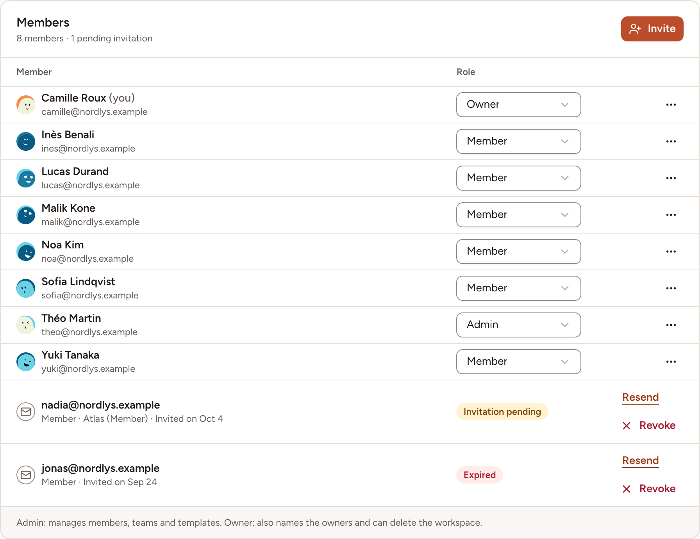
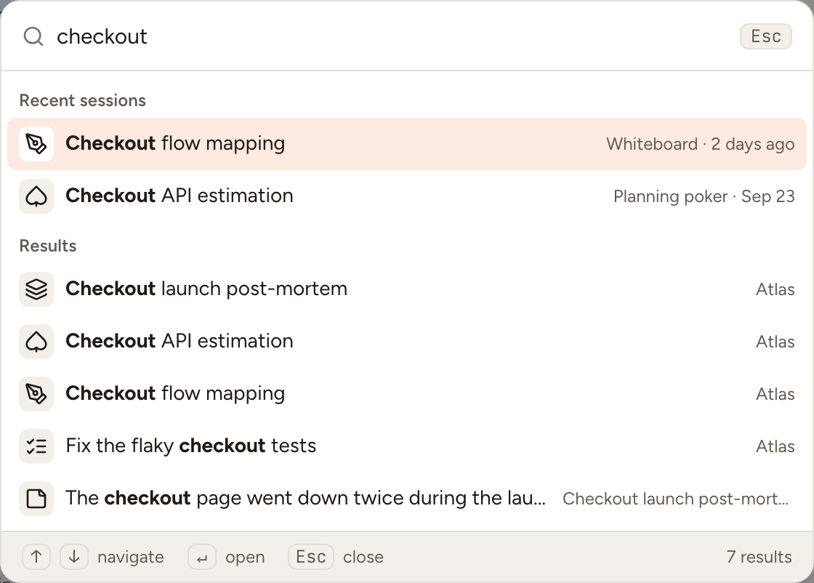

A workspace groups your teams, the people in them and the templates they share. This page shows how to find your way around a workspace, who may manage it, and how to create or switch workspaces.

## Open the workspace page

In the sidebar, under **Workspace**, select **All teams**.

The page shows the workspace's name, how many teams and members it has, your role in it, and one tile per team. A workspace owner or admin sees every team; a member sees the teams they belong to. Each tile tells whether a retro is in progress or when the last one took place, the active poker games, the open action items and how many are late. Select a tile to open the team.

Owners and admins also get **Invite people**, **New team**, and a pencil beside the name that changes the workspace's name and description. The workspace's address does not change when you rename it.

## Workspace roles

| Role | What it may do |
|---|---|
| **Member** | Open the teams they belong to and see the workspace's templates. |
| **Admin** | Also manage the workspace's members, teams and templates. An admin can open and manage every team without being one of its members. |
| **Owner** | Also name other owners and delete the workspace. |

The person who creates a workspace is its owner. A workspace always keeps at least one owner: the last one cannot leave or take a lower role.

## Manage the members

Owners and admins only.

1. On the workspace page, select **Invite people**. The **Members** page opens.
2. To change a role, pick it in the list of the **Role** column. An admin can give **Admin** or **Member** and cannot change an owner; an owner can also give **Owner**.
3. To remove someone, open the menu at the end of their row and select **Remove from workspace**. They lose access to the workspace and are removed from all of its teams.
4. To bring someone in, select **Invite**. See [Invitations and invite links](../invitations/).

## Leave or delete a workspace

To leave, select **Leave workspace…** at the bottom of the workspace page and type the workspace's name to confirm. You lose access to its teams, sessions and templates. Your action items stay assigned to you until someone reassigns them.

An owner deletes the workspace from the **Delete workspace** card of the **Members** page, also by typing its name.

> Deleting a workspace is permanent. It deletes its teams and their sessions, boards and action items, the templates and the invitations.

## Create another workspace and switch

1. Select the switcher at the top of the sidebar: it shows the current team and workspace.
2. Under **Workspaces**, select a workspace to switch to it, or select **New workspace**.
3. For a new one, type a **Workspace name** and select **Create workspace**. You are its owner.

Skrüm remembers the last workspace you opened and returns to it when you come back.

## Search

Select **Search…** in the top bar, or press <kbd>⌘</kbd><kbd>K</kbd> (<kbd>Ctrl</kbd><kbd>K</kbd> on Windows and Linux) or <kbd>/</kbd>.

Before you type, the palette lists **Actions**, the five **Recent sessions** of your teams (the ones in progress first, marked **Live**) and the pages you can **Go to**. From two characters on, **Results** adds what matches in the teams you can open in the current workspace: retrospectives, planning poker games (by their title or the title of one of their tasks), whiteboards, games, surveys, action items and retro cards, five of each at most. A draft survey and what is drawn on a whiteboard are not searched.

## Notifications

The bell in the top bar gathers what concerns you: invitations, which you can accept or decline from there, sessions about to start, action items due or overdue, mentions on a card, requests to join a team you manage, and the recap of a closed retro. **Mark all as read** clears the count. **Notification settings** leads to the preferences described in [Account settings](../../accounts/account-settings/).
