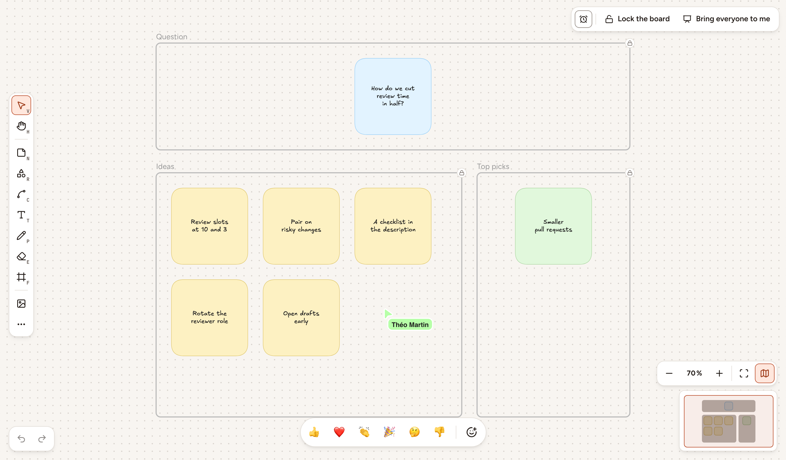
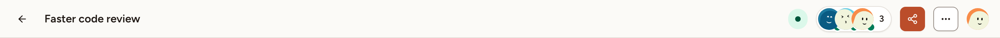

A whiteboard is a shared canvas that belongs to a team. This page shows how to create one, move around it, and work on it with other people. The members of the team and the owners and admins of its workspace can open its whiteboards. An observer of the team can look at a board but cannot draw on it.

## Create a whiteboard

Observers of the team cannot create a whiteboard.

1. On the team's page, select **New session**, then **Whiteboard**. A team that has no session yet also shows a **New whiteboard** tile, which opens the same dialog.
2. Type a **Name**.
3. Under **Template**, keep **Blank** or pick one of the [templates](../templates/).
4. To let people in without an account, turn on **Allow guests without an account**.
5. Select **Create & open**.

The board opens and you are its facilitator. A whiteboard is never closed: it stays in the team's **Sessions** list, under **Whiteboard**, until someone deletes it.

## Move and zoom

- To move the view, select the **Hand** tool (`H`) and drag, or hold `Space` and drag.
- In the bar at the bottom right, **Zoom out** and **Zoom in** change the zoom by 10 % at a time, between 10 % and 3000 %. Select the percentage to go back to 100 %.
- **Fit to screen** (`Shift` + `1`) shows everything that is on the board.
- **Minimap** (`M`) shows or hides a small map of the whole board. The frame on the map is the part you see: click or drag on the map to move there. The minimap is available in a window at least 1024 pixels wide.

## See who is here

The header shows the avatars of the people who are on the board, and how many they are. Their pointers move on your canvas, each with its owner's name.

To stop showing your pointer to the others, open the board menu (the **Board menu** button, marked `…`) and select **Hide my cursor**.

The bar at the bottom of the canvas sends a reaction, which flies across everyone's screen with your name.

## Facilitate

Whoever creates a board is its facilitator. Only the facilitator has the bar at the top right of the canvas:

- **Timer** starts a countdown of 1, 3, 5 or 10 minutes that everyone sees. While it runs, **+2 min** adds two minutes and **Stop timer** ends it.
- **Lock the board** stops everyone else from changing the board. They read "This board is locked." and can still move and zoom.
- **Bring everyone to me** makes the view of the others follow yours. Someone who moves or zooms on their own stops following, and gets a **Resume** button to follow again.

The facilitator also renames the board, by selecting its name in the header, and finds these entries in the board menu: **Hand over facilitation**, to a member of the team who takes part or to an owner or admin of the workspace, and the switches **Show live cursors** and **Show flying reactions**, which apply to everyone.

When the facilitator is away, anyone on the board who is neither a guest nor an observer can select **Take control** in the board menu.

## Read on a phone

On a screen narrower than 768 pixels, a board opens in read mode, marked **Reading**: you look at the board without changing it. Select **Edit** to draw, and **Read** to go back.

## Invite people

Members of the team do not need an invitation: they open the board from the team's page. For anyone else:

1. Select **Share** in the header.
2. Copy the guest link, show the QR code, or give the **Session code**, which people type at the address written under it.

The link, the QR code and the code only work while **Allow guests without an account** is on. The facilitator changes that switch in the same dialog. A guest picks a nickname and joins without an account, as [Join as a guest](../../getting-started/join-as-guest/) explains. A guest draws like a member, but cannot share or duplicate the board, save it as a template, or become its facilitator.

> Turning guest access off ends the access of the guests who are on the board. **Regenerate link** does the same, and the old link, QR code and code stop working.

## Duplicate or delete a board

In the board menu, **Duplicate this board** opens a copy that holds the same elements and images, with "(copy)" at the end of its name. You are the facilitator of the copy, and its guest access, lock and timer are off. Guests and observers cannot duplicate a board.

**Delete this board** is offered to the facilitator and to the owners and admins of the workspace. Everything on the board is removed for everyone.
