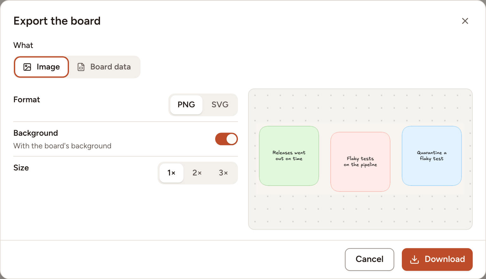

You can save a whiteboard as a picture, in PNG or SVG, or as a data file that holds everything on it. Everyone on the board can export it, guests included.

## Open the export dialog

Select **Export** in the header of the board. In a window narrower than 1536 pixels the header has no room for that button: open the board menu (the **Board menu** button, marked `…`) and select **Export** there.

## Save a picture

1. Under **What**, keep **Image**.
2. Choose the **Format**: **PNG** or **SVG**.
3. Leave **Background** on to paint the picture with the board's background colour, or turn it off for a see-through background.
4. For a PNG, choose the **Size**: **1×**, **2×** or **3×**. An SVG has no size to choose: it stays sharp at every size.
5. Check the preview, then select **Download**.

The picture holds every element of the board, not only the part on your screen. The file is named after the board, for example `Faster code review.png`.

To export part of a board, select the elements first, then open the dialog and turn on **Only the selection**. That switch is only there when something is selected. A selected shape comes with its text, and a selected frame with what it holds.

On an empty board the preview reads "Nothing to draw yet." and **Download** is off.

To copy the board to the clipboard as a PNG without opening the dialog, press `Shift` + `Alt` + `C` on the canvas.

## Save the board data

1. Under **What**, select **Board data**.
2. Select **Download**.

You get a JSON file named after the board, ending in `.whiteboard.json`, with every element of the board and the images it holds.

> Skrüm has no command that opens this file again. To start another board from this one, [duplicate it](../basics/) or [save it as a template](../templates/).
