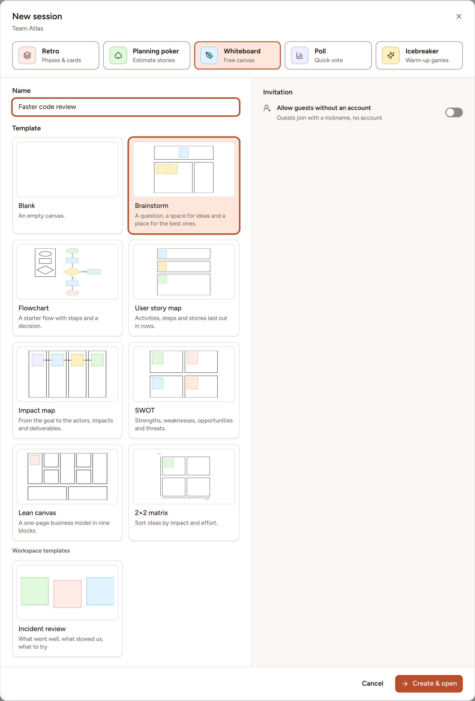

A new whiteboard starts empty or from a template. Skrüm has 8 built-in templates, and a workspace can save its own boards as templates. Anyone who may create a whiteboard may use any of them.

## The built-in templates

| Template | What it gives you |
|---|---|
| **Blank** | An empty canvas. |
| **Brainstorm** | A question, a space for ideas and a place for the best ones. |
| **Flowchart** | A starter flow with steps and a decision. |
| **User story map** | Activities, steps and stories laid out in rows. |
| **Impact map** | From the goal to the actors, impacts and deliverables. |
| **SWOT** | Strengths, weaknesses, opportunities and threats. |
| **Lean canvas** | A one-page business model in nine blocks. |
| **2×2 matrix** | Sort ideas by impact and effort. |

## Start a board from a template

A template is chosen when the board is created. It cannot be applied to a board that already exists.

1. On the team's page, select **New session**, then **Whiteboard**.
2. Under **Template**, select a template. **Blank** is selected when the dialog opens.
3. Type a **Name** and select **Create & open**.

The labels of a built-in template are written in your language when the board is created. Its frames and the other parts of its structure are [locked](../tools/), so they stay in place while people work; the facilitator can unlock them. Its sample notes are ordinary notes: edit them, move them or delete them.

## Save a board as a workspace template

Anyone on the board who is neither a guest nor an observer can save it as a template.

1. Open the board menu (the **Board menu** button, marked `…`) and select **Save as template**.
2. Type a **Name**, of up to 80 characters, and if you want a **Description**, of up to 300.
3. Select **Save**.

The template holds a copy of everything on the board, images included. It appears under **Workspace templates** in the New session dialog of every team of the workspace. Changing or deleting the board afterwards does not change the template.

A workspace holds up to 50 whiteboard templates, and two of them cannot have the same name.

## Rename or delete a workspace template

The person who saved a template and the owners and admins of the workspace can change it, in either of two places:

- On the team's **Sessions** page, select **Whiteboard**, then **Whiteboard templates**. Each template you may change has **Edit** and **Delete**.
- On the workspace's **Templates** page, select the **Whiteboard** tab. A template's card has **Use**, which starts a new whiteboard from it, and the menu of the card has **Rename** and **Delete**.

Deleting a template does not change the boards that were created from it.
