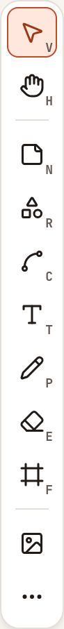
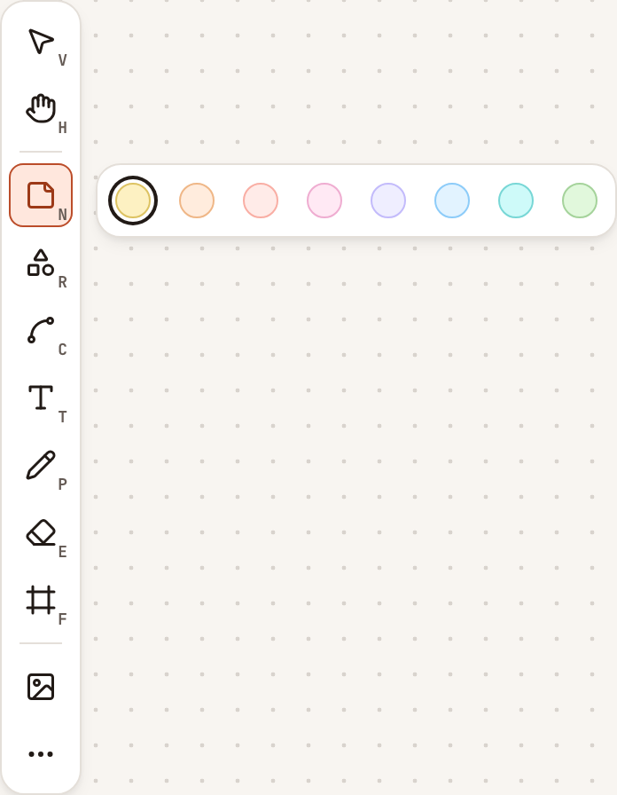
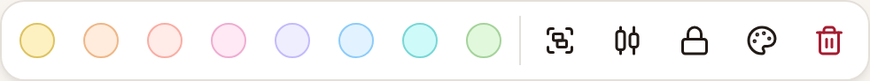

You draw on a whiteboard with the tool bar on the left of the canvas, and you change what you selected with the bar that appears under the selection. Everyone on the board has these tools, guests included, except an observer of the team and, while the board is locked, everyone but the facilitator.

## The tool bar

From top to bottom:

| Tool | Key | What it does |
|---|---|---|
| **Selection** | `V` | Selects and moves elements. Drag across an empty area to select several. |
| **Hand** | `H` | Moves the view. |
| **Sticky note** | `N` | Adds a note in one of eight colours. |
| **Shape** | `R` | Draws a **Rectangle**, a **Diamond** or an **Ellipse**, filled with one of the eight colours. |
| **Connector** | `C` | Draws an **Arrow** or a **Line**. |
| **Text** | `T` | Click on the board, then type. |
| **Pencil** | `P` | Draws freehand. |
| **Eraser** | `E` | Removes elements. |
| **Frame** | `F` | Draws a frame, an outlined area that holds the elements placed in it. |
| **Image** | none | Adds a picture from your device. |

The last button, **More tools**, holds:

- **Laser pointer** (`K`), which leaves a short trail on your own screen and draws nothing on the board.
- **Keep the tool** (`Q`), which keeps the current tool selected after you used it.
- **Pen mode**, listed once the board has seen a pen.

The letter keys work while single-key shortcuts are on; see [Keyboard shortcuts](../../accounts/keyboard-shortcuts/).

At the bottom left of the canvas, **Undo** and **Redo** act on your own changes.

On a phone, the tools are in a shorter bar at the bottom of the screen, without **Connector** and **Frame**.

## Add a sticky note

1. Select **Sticky note**. A bar of eight colours opens: Sun, Apricot, Coral, Plum, Iris, Sky, Lagoon and Moss.
2. Select a colour: a note of that colour is added in the middle of the view. Or click on the board: a note of the current colour is placed there.
3. Double-click the note and type. Click elsewhere when you are done.

After a note is added, the board goes back to the **Selection** tool, unless **Keep the tool** is on.

## Change a selection

Select one element, or several, and a bar appears under the selection. A label on the corner of the selection counts what it holds, for example "3 elements".

From left to right:

- The eight colours, when the selection holds a sticky note, a rectangle, a diamond or an ellipse. Selecting one fills those elements with it.
- **Group**, when you selected two elements or more, or **Ungroup**, when you selected one group.
- **Align**, when you selected two elements or more: **Align left**, **Align right**, **Align top** and **Align bottom**, and, from three elements, **Distribute horizontally** and **Distribute vertically**.
- **Lock**, for the facilitator only.
- **Styles**, which opens a panel of style options for the selection beside the tool bar.
- **Delete**.

With a single element selected, the bar has the colours (for a filled element), **Lock** (for the facilitator), **Styles** and **Delete**.

## Locked elements

An element the facilitator locked carries a small lock on its corner and cannot be moved, changed or deleted by anyone else. Click it to see **Locked** and an **Unlock** button, which only works for the facilitator; the others read "Only the facilitator can change a locked element." The facilitator can also select **Unlock everything** in the board menu.

## Add an image

Select **Image** and choose a file. A board takes PNG, JPEG, WebP and GIF images of up to 5 MB each, and 100 MB of images in all. Files of another kind cannot be added.

## Other commands and limits

The board menu (the **Board menu** button, marked `…`) also has **Find on canvas**, **Canvas help**, **Clear canvas**, which removes what is on the board, for everyone, after a confirmation, and **Canvas background**, which changes the colour of the paper on your own screen: **Paper**, **White**, **Light grey**, **Light blue**, **Light yellow** or **Light beige**.

A board holds up to 5,000 elements. Past that, a new element is refused with "This board is full."
